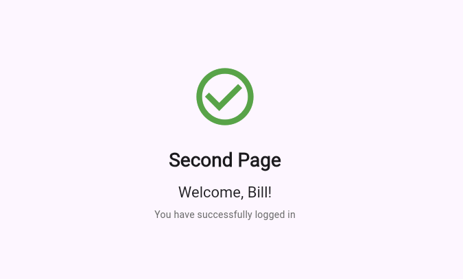
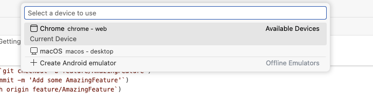

# login_proj_1

This is a short project to create a login screen and simulate the login process.

## Overview

This is a Flutter application built with Dart that displays an initial login screen requiring a username/password combination and simulates login.
It does not include any backend or API methods to actually authenticate or login - simply display an approximation for this.

### Key Features

- Login screen
- Username and password fields
- Login feature to simulate login
- A successful login page as a 2nd page is included.

## Screenshots




## Requirements

Before you begin, ensure you have the following installed on your system:

### Required Software

- **Flutter SDK**: Version 3.0.0 or higher
  - Download from [flutter.dev](https://flutter.dev/docs/get-started/install)
- **Dart SDK**: Version 3.0.0 or higher (included with Flutter)
- **Git**: For cloning the repository
- **IDE**: One of the following:
  - Android Studio (recommended) with Flutter and Dart plugins
  - Visual Studio Code with Flutter and Dart extensions
  - IntelliJ IDEA with Flutter plugin

### Platform-Specific Requirements

#### For Android Development
- **Android Studio** or **Android SDK Command-line Tools**
- **Android SDK** (API level 21 or higher)
- **Java Development Kit (JDK)** version 11 or higher

#### For iOS Development (macOS only)
- **Xcode** 13.0 or higher
- **CocoaPods** (installed via `sudo gem install cocoapods`)
- **macOS** 10.15 (Catalina) or higher

#### For Web Development
- **Chrome** browser (for debugging)

#### For Desktop Development
- **Windows**: Visual Studio 2022 or Visual Studio Build Tools 2022
- **macOS**: Xcode
- **Linux**: Additional development tools (`sudo apt-get install clang cmake ninja-build pkg-config libgtk-3-dev`)

## Getting Started

Follow these steps to clone and run the project locally:

### 1. Clone the Repository

```bash
git clone https://github.com/graemetennent-creator/login_proj_1.git
cd login_proj_1
```

### 2. Verify Flutter Installation

Check that Flutter is properly installed and configured:

```bash
flutter doctor
```

This command checks your environment and displays a report. Resolve any issues indicated by the doctor before proceeding.

### 3. Install Dependencies

Install all required packages specified in `pubspec.yaml`:

```bash
flutter pub get
```

### 4. Configuration (if applicable)

If your project requires additional configuration:

- Copy `.env.example` to `.env` and fill in required values
- Update `lib/config/app_config.dart` with your settings
- Add any necessary API keys or credentials

### 5. Run the Application
This application needs to use local Chrome application to debug and run locally. It has been set to use Chrome for simplicity.
To do this select Chrome from the browser selection menu in VSCode (or your IDE)



#### For Mobile (Android/iOS)

Connect a physical device or start an emulator, then run:

```bash
# List available devices
flutter devices

# Run on a specific device
flutter run -d <device_id>

# Run in debug mode (default)
flutter run

# Run in release mode
flutter run --release
```

#### For Web

```bash
flutter run -d chrome
```

#### For Desktop

```bash
# Windows
flutter run -d windows

# macOS
flutter run -d macos

# Linux
flutter run -d linux
```

## Project Structure

```
lib/
├── main.dart           # Application entry point
├── models/             # Data models
├── screens/            # UI screens/pages
├── widgets/            # Reusable widgets
├── services/           # Business logic and API services
├── utils/              # Utility functions and helpers
└── constants/          # App constants and configurations

test/                   # Unit and widget tests
android/                # Android-specific code
ios/                    # iOS-specific code
web/                    # Web-specific code
```

## Building for Production

### Android APK

```bash
flutter build apk --release
```

The APK will be located at `build/app/outputs/flutter-apk/app-release.apk`

### Android App Bundle (for Play Store)

```bash
flutter build appbundle --release
```

### iOS (requires macOS)

```bash
flutter build ios --release
```

Then open `ios/Runner.xcworkspace` in Xcode to archive and upload to App Store.

### Web

```bash
flutter build web --release
```

The web build will be in the `build/web` directory.

## Running Tests

Run all tests:

```bash
flutter test
```

Run tests with coverage:

```bash
flutter test --coverage
```

## Common Issues and Troubleshooting

### Issue: "Waiting for another flutter command to release the startup lock"

**Solution**: Delete the `flutter.lock` file in your Flutter installation directory's `bin/cache` folder.

### Issue: Gradle build fails

**Solution**: 
```bash
cd android
./gradlew clean
cd ..
flutter clean
flutter pub get
```

### Issue: CocoaPods installation fails (iOS)

**Solution**:
```bash
cd ios
pod deintegrate
pod install
cd ..
```

### Issue: "Lost connection to device"

**Solution**: Restart your device/emulator and try again. Check USB debugging is enabled on Android devices.

## Dependencies

Key packages used in this project:

- `Flutter SDKs`: Flutter framework SDK file (https://docs.flutter.dev/install/quick)
- `Dart SDKs`: SDK file for using Dart (https://dart.dev/get-dart)


For a complete list, see `pubspec.yaml`.

## Contributing

1. Fork the repository
2. Create your feature branch (`git checkout -b feature/AmazingFeature`)
3. Commit your changes (`git commit -m 'Add some AmazingFeature'`)
4. Push to the branch (`git push origin feature/AmazingFeature`)
5. Open a Pull Request

## Versioning

We use [SemVer](http://semver.org/) for versioning. For available versions, see the [tags on this repository](https://github.com/graemetennent-creator/login_proj_1.

## License

This project is unlicensed - see the [LICENSE](LICENSE) file for details.

## Contact

Your Name - Graeme Tennent - graeme.tennent@gmail.com

Project Link: [https://github.com/graemetennent-creator/login_proj_1]

## Acknowledgments

- List any resources, contributors, or inspiration - Special mention to Julian... for already spotting how I can't use FIND + REPLACE functions...
- Previously listed
